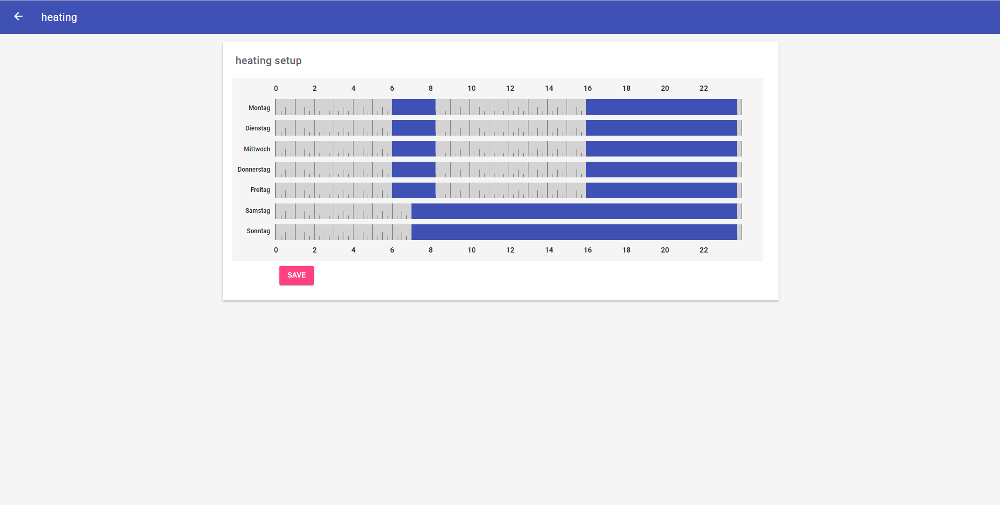
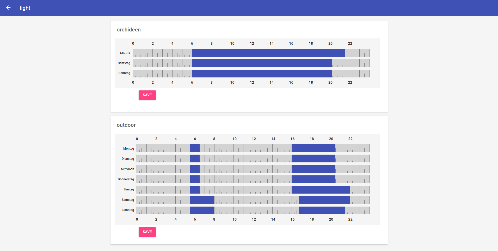
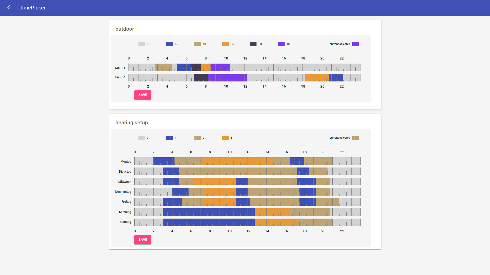
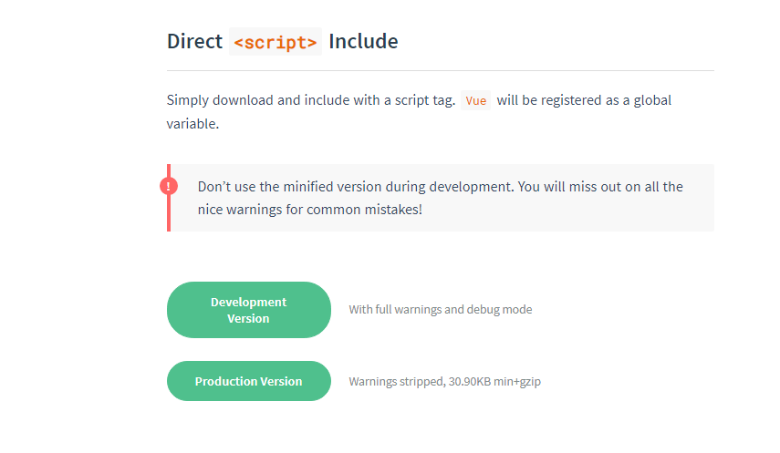
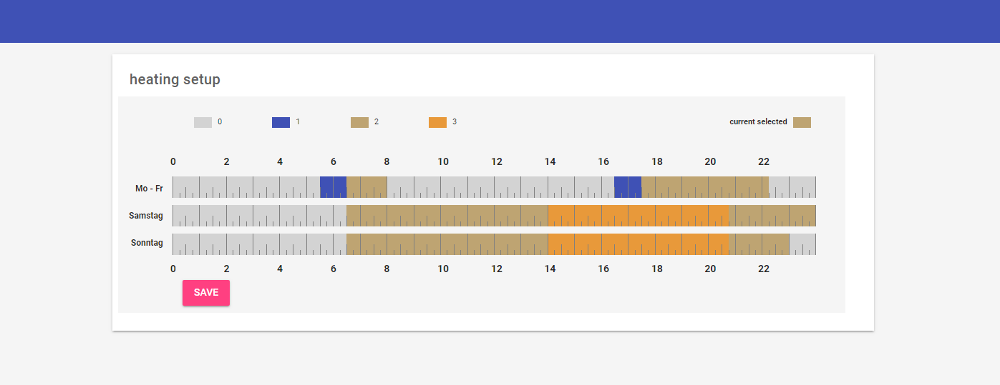

# openhab timeline picker

This project extends openHAB basicUI by a sitemap component to setup timebased processes. (e.g. heating control, light control or rollershutter)

In the component you can edit one or multiple scales. The scales represent the day's of the week and the time of day from
0.00am to 12.00pm. By url parameter you can specify the displayed day's of the week and whose grouping. It's possible
to choose monday to sunday, monday to friday, saturday to sunday and each day one at a time.
The final processing occured in a openhab rule.  
The communication takes place via the REST- interface. When you have problems with CORS, add the following line in the file services/runtime.cfg: org.eclipse.smarthome.cors:enable=true

**sitemap samples:**<br>



## Preparation and example

### requirements

The following dependences in openHAB exist: MapDB, JSONpath

#### files and locations

First create the following directorys at the spezified position:<br>

| location                             | directory              |
| ------------------------------------ | ---------------------- |
| openhab-conf/html/                   | time-line-picker       |
| openhab-conf/html/time-line-picker/  | js                     |
| openhab-conf/html/time-line-picker/  | css                    |
<br>
Download vue.js under this link: https://vuejs.org/v2/guide/installation.htm<br>
Copy the file at this location: openhab-conf/html/time-line-picker/js/<br>
<br>
hint: download the Development Version<br><br>

Next download vue-resource.js under this link: https://github.com/pagekit/vue-resource<br>
Extract the file vue-resource.js at this location: openhab-conf/html/time-line-picker/js/<br><br>

Download this project from https://gitlab.com/RNTs_3/openhab-timeline-picker and save:<br>

| location                                | file                      |
| --------------------------------------- | ------------------        |
| openhab-conf/html/time-line-picker/     | index.html                |
| openhab-conf/html/time-line-picker/js/  | switchPointSet.js         |
| openhab-conf/html/time-line-picker/js/  | prefs.js         |
| openhab-conf/html/time-line-picker/css/ | switchPointSet.css        |
| openhab-conf/rules                      | timeLinePicker.rules      |

#### declare item, persisst, rule and sitemap
To communicate with openHAB rules we must declare a string item.<br>
**note1:** This item must be persisted. So, after a restart of openHAB switch points will be restored.<br>
**note2:** It's recommendable that all controlled items also be persisted and restored at startup.<br>
 MapDB is a good solution.

Example files are placed in the GitLab repository:

example.item:
```
Group gTimepicker
Group gTimepickerObserver
String TimelineHelper "[%s]"
String TransferItem1 "[%s]"      (gTimepicker)
String TransferItem2 "[%s]"      (gTimepicker)

Switch item1                     (gTimepicker)
Switch item2                     (gTimepicker)
Dimmer item3                     (gTimepicker)
```

mapdb.persist:
```
Strategies {
  default = everyChange
}

Items {
  gTimepicker* : strategy = everyChange, restoreOnStartup
}
```

timeLinePicker.rules (it's an extract and shows the config part, download the complete file from GitLab):
```
import org.eclipse.smarthome.model.script.ScriptServiceUtil
import java.util.HashMap
import java.util.ArrayList

// timeline/ timepicker control
// version 0.xx.xx
// ToSe
//
// init values & customize for you own enviroment
// -----------------------------------------------------------------------------------------------------------
//
//
// requirements: MapDB, JSONpath transformation
// -----------------------------------------------------------------------------------------------------------
//  String xxxSwitchPoints                   "xxxxxx [%s]"                            (gTimepicker)
//  
//  String TimelineHelper                    "[%s]"
//  Group  gTimepicker
//  Group  gTimepickerObserver
//
//
// data structure
// -----------------------------------------------------------------------------------------------------------
// val HashMap<String,  ArrayList<String>> timePicker = newHashMap(
//     "TransferItem1" -> newArrayList('item1','item2',...),                // enum all items to control
//     "TransferItem2" -> newArrayList('item3')
//     ...                                                                  // enum all TransferItems
//     // you control as many widgets as you need
// )
//
//

// -------------------- part of config -----------------------------------------------------------------------

val HashMap<String,ArrayList<String>> timePicker = newHashMap(
    "TransferItem1" -> newArrayList('Thermostat1','Thermostat2'),  
    "TransferItem2" -> newArrayList('LightSwitch45')
)

// -------------------- end of config ------------------------------------------------------------------------


// -------------------- don't change anyone ---------------------------------------------------------------
val HashMap<String,String> oldStates = newHashMap()

rule "timeLine picker 1"
when .....
```

example.sitemap:
```
Frame label="heating Example" {
    Webview url="http://ip-addr-openHAB:8080/static/time-line-picker/index.html?ip=xx.xx.xx.xx:8080&transferItem=TransferItem1&yAxisLabel=1,2,3,4,5,6,7" height=14
}
```

## Usecase



The heating is switched in the example above (Item's Thermostat1 and Thermostat2 in example.rules).
You can set the various switch states (0,1,2,3) by select a state end then click and move over the scale.
When you select a other state you will overwrite the existing state in the scale.

The webview url is declared as follow:

http://ip-addr-openHAB:8080/static/time-line-picker/index.html?urlParameter (ip-addr: ip from your openHAB instance)

| url parameter | necessary                              | values         | description                                                      | example                 |
| ------------- | -------------------------------------- | -------------- | ---------------------------------------------------------------- | ----------------------- |
| ip            | required                               | _user defined_ | server-ip openHAB and port                                       | &ip=192.168.2.100:8080      |
| transferItem  | required                               | _user defined_ | characterizes the item to communicate with openHAB rule          | &transferItem=TransferItem1            |
| states        | optional<br>default: OFF,ON            | _user defined_ | define switch states; maximum count is six                       | &states=<br>0,15,50,100<br>0,10,25,55,80,100<br>INCREASE,DECREASE |
| yAxisLabel    | optional<br>default: mo,tu,we,th,fr,sa,su | 1, 2, 3, 4, 5, 6, 7 = monday, thusday, wednesday, thursday, saturday, sunday<br>17 = monday to sunday<br>15 = monday to friday<br>67 = saturday to sunday | characterizes the assignment scales to days<br> monday, thusday, wednesday, thursday, friday, saturday, sunday | &AxisLabel=15,6,7 |
| lang          | optional<br>default: en            | **en** - english<br>de - german<br>pt - portuguese<br>it - italian<br>nl - dutch  | language for y-axis                                              | &lang=en         |
| event         | optional<br>default: no                | **no**,yes     | action will triggert when state is set, the manuell state is 'passiv' and you can control the item manuell, after a complete action interval the item state befor will recoverd | &event=yes |
| dark          | optional<br>default: no                | **no**,yes     | switch widget in dark mode                                       | &dark=yes               |
| zoom<br>*since 0.7.x* | optional<br>default: auto      | **auto**, no, force | control zoom slider for mobiles and tablets                   | &zoom=force             |
| colorset<br>*since 0.7.2 | optional<br>default: 1      | **1**,2,3<br>hexValue1,hexValue2,..., hexValue7 | select one of three predefined colorsets or select your own colors as hex value (the '#' in front of hex value is not nessesary)<br>Then event parameter is yes, the hexValue1 is for maunal mode. | &colorset=2<br>&colorset=555E7B,B7D968,B576AD<br>&colorset=555E7B,B7D968,B576AD,E04644,FDE47F,7CCCE5,D486E8 |
| deactivation | optional<br>default: false              | **false**,true | ability to deactivate the timeline                                | &deactivation=true     |             

complete example for url:
http://192.168.2.100:8080/static/time-line-picker/index.html?ip=192.168.2.100:8080&transferItem=TransferItem1&states=0,1,2,3&yAxisLabel=1,2,3,4,5,67&lang=en&event=no&dark=no&zoom=force&colorset=555E7B,B7D968,B576AD,E04644,FDE47F,7CCCE5,D486E8&deactivation=true


When you change the state parameter and it's exist a saved value you will get a warn messages.
This should be protected from unintentional changes.


So, you can set the switch intervall in 15min steps by click or touch the scale. Befor select the state.
Finally you must tranfer the new date by press the save button and confirm.

**version 0.7.x**<br>
.1. Especially for small devices exist now a zoom function. As standard the zoom is activ on mobiles and tablets. On desktops you must force the zoom witch an url- parameter.
Where are no breaking changes in the data structur. All scheduling definition is retained.
In order to recognize the correct orientation on the mobiles and tablets, it is necessary to choose a greater value for height in the sitemap.
.2. Portuguese and italien language as axis label is added.
Replace only the index.html, switchPointSet.js, switchPointSet.css files.<br>

**version 0.7.2**<br>
[enhancement] It is posssible to define own colors for the single switch states or select various predefined colorsets. (merged in master branch)
Replace only the index.html, switchPointSet.js, switchPointSet.css files.<br>

**version 0.7.3**<br>
[enhancement] It is posssible to temporary deactivate an timeline (merged in develop branch)<br>
**hint:** Copy this line in your item file to create a nessesary item for this function:<br>
```
String TimelineHelper                 "[%s]"
```
Replace the index.html, switchPointSet.js, switchPointSet.css and timeLinePicker.rules files.<br>

**version 0.7.4**<br>
[enhancement] Add support for dutch language
Replace only the switchPointSet.js, prefs.js files.<br>

**note:** After replacing the files one must clear the browser cache.


If you find a bug or have a idea for a new feature just open a new issue at gitlab. https://gitlab.com/RNTs_3/openhab-timeline-picker/issues<br>
Thanks.
