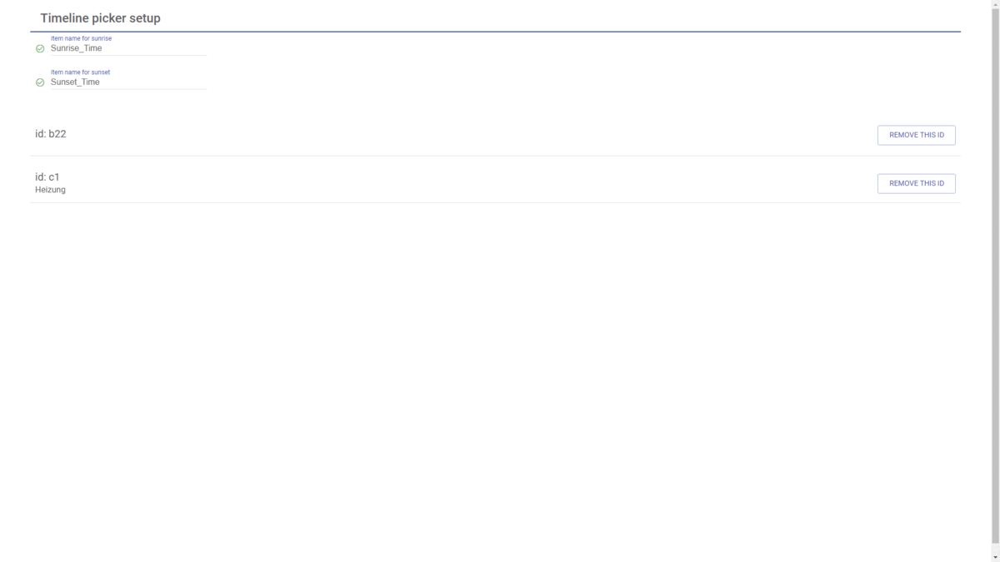
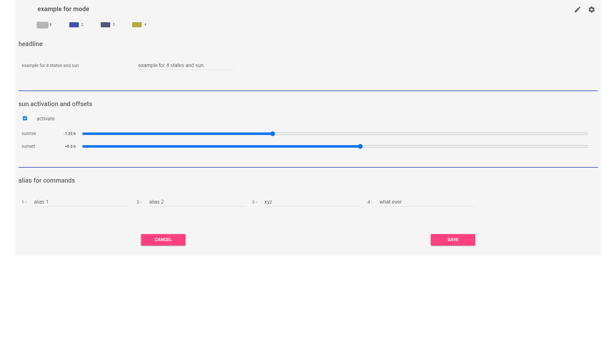
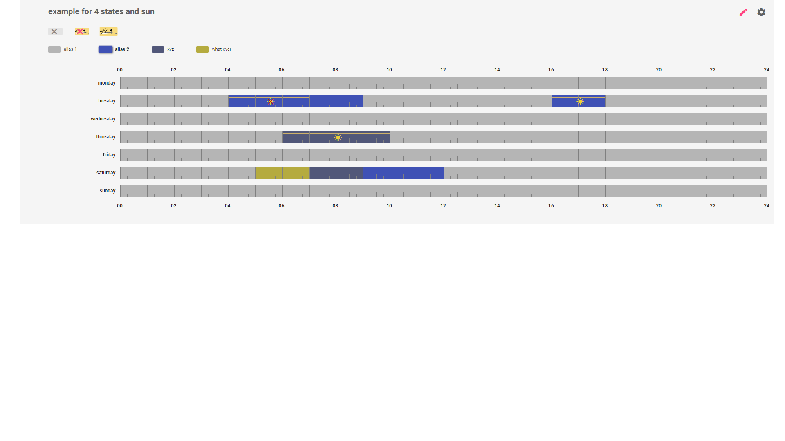
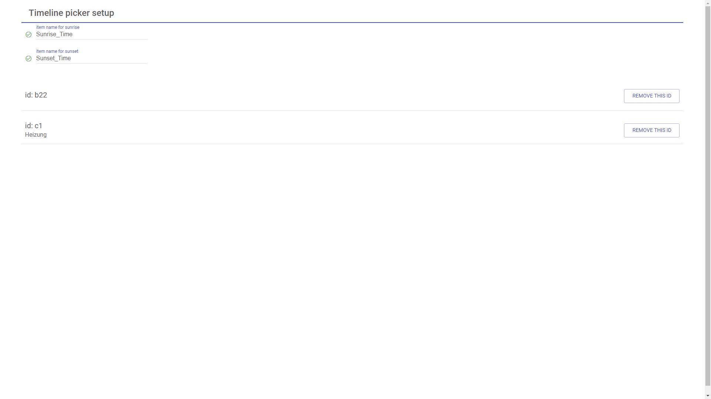

# openHAB timeline picker v3

This project extends openHABs basicUI by a sitemap component to setup timebased processes. (e.g. heating control, light control, rollershutter)

In the component you can set and change intervals by mouse or touch and combine them with any switching states. An alias for each switching state is possible, which is displayed in the legend. (e.g. heating control: 23°C - alias: comfort). By combination with sunrise and sunset relative switching points are possible. The setup of the timeline picker is done by url parameters when calling it in the sitemap and/or in the setup of the timeline itself.
The second part is a rule, which actually does the switching. In the default configuration this rule is called in 2min intervals. This is the smallest value of a state change switching for sun position dependent processes. For switch events the smallest interval in the timeline is 15min.
The communication takes place via the REST- interface. When you have problems with CORS, add the following line in the file services/runtime.cfg: org.eclipse.smarthome.cors:enable=true

## Whats new in V3

There is a possibility to switch states depending on the position of sun. The installation of the widget is much easier. You must not define helper item and groups. The persistence setup is also obsolete. All adjustments are included in openHAB backups (values stored in JsonDB). The internal datastructur is much more flexible for further features.
In addition, a setup area is introduced with v3.

There is only support for javascript. (you will find older versions here in 'Get started')

###### sitemap samples:



## **Get started**

### **Dependencies**

* JS Scripting Add-ON must be installed for OH >= 3.0
* Astro Binding (only for sun events)
* create a token for your OH REST- Interface
* new Rule Engine for OH <= 2.4

### **Files and Locations**

#### **v3 for openHAB 3.x** (JS Scripting Add-ON)

Copy the following files and folder with all included sub folders and files to your openhab config location (usually found here:  $OPENHAB_CONF)
For the full path execute the following command: echo $OPENHAB_CONF

| location | folder | file |
| -------- | ------ | ---- |
| $OPENHAB_CONF/html/tlp-jsr/ | complete |
| $OPENHAB_CONF/automation/js/RNTs-tlp3.js | file |
| $OPENHAB_CONF/automation/js/conf/00_RNTs-tlp3_conf.js | file |

#### **[depricated] v3 for openHAB <= 2.4**  (new Rule engine)

Download this project from gitlab for openHAB 2.x [time-line-picker](https://gitlab.com/RNTs_3/openhab-timeline-picker/-/tree/develop_v3.x_for_OH2.4) and save it on your drive.

or execute the following command if git is installed on your system:
git clone -b develop_v3.x_for_OH2.4 <https://gitlab.com/RNTs_3/openhab-timeline-picker.git>

#### **Previous versions**

<details>
<summary>click here</summary><br>
  
##### **v2 for openHAB <= 2.4** New Rule engine (javascript)

[see on GitLab](https://gitlab.com/RNTs_3/openhab-timeline-picker/-/tree/v2.0.1)
Please see the readme in the repository for install, use and instructions.

##### **v1 for openHAB 3.x** RuleDSL

[see on GitLab](https://gitlab.com/RNTs_3/openhab-timeline-picker/-/tree/v0.8.0)
Please see the readme in the repository for install, use and instructions.

##### **v1 for openHAB <= 2.4** RuleDSL

[see on GitLab](https://gitlab.com/RNTs_3/openhab-timeline-picker/-/tree/v1.0.0)
Please see the readme in the repository for install, use and instructions.

</details><br>

## **Parameter and Examples**

#### **items, sitemap and conf file (optional)**

Each single timeline is spezified with an unique id.

example.item:

```item-file
Switch  demoItem1
Switch  demoItem2
Dimmer  demoItem3
Dimmer  demoItem4
```

00_RNTs-tlp3_conf.js (optional):
Here you can assoziate items to control. It is also possible to make the mapping as parameter in the url. See parameter table below. After changing this config the 

```openHAB
const tlp_ids = {
  'uniqueID': 'demoItem1, demoItem2',
  'heating_central': 'demoItem3',
  'x1': 'demoItem4',
  // ...
}

module.exports = {
  tlp_ids
}
```

example.sitemap:

```openHAB
Frame label="timeline example" {
    Webview
      icon="none"
      url="/static/tlp-jsr/index.html?id=uniqueID&mode=1,2,3,4,5,6,7&token=oh.TimeLinePicker.xxxxxxxxxxx"  // place your own token
      height=14
}
```

***

**The webview url is declared as follow: `/static/tlp-jsr/index.html?urlParameter`**

### **Parameter: id**, required

value: user defined  
*unique identfier for this timeline*  
example: `&id=uid_123`

### **Parameter: token**, required

value: generated in OH main UI  
example: `&token=oh.TimeLinePicker.xxxxxxxxxxxxxxxxx`

### **Parameter: conf**, optional, default: params

value: params, ui  
*params .. main configurations only with ui  
ui .. configuration with ui, for the first call or changing you can use params and init this*  
example: `&conf=ui`

### **Parameter: mode**, optional, default: 1,2,3,4,5,6,7

value: 1,2,3,4,5,6,7 = monday, thusday, wednesday, thursday, saturday, sunday  
15 = monday to friday  
67 = saterday to sunday  
17 = monday to sunday
*characterizes the assignment scales to days*  
example: `&mode=15,6,7`

### **states**, optional, default: OFF,ON

value: user defined  
*define switch states (maximum count is six)*  
example: `&states=0,15,50,100, &states=INCREASE,DECREASE, &states=OFF,ON, &states=value1,value2,value3` (strings for use in own rules)

### **linkedItems**

value: item names defined in openHAB  
*define the items to be controlled*  
example: `&linkedItems=demoItem1,demoItem2,demoItem3`

### **Parameter: lang**, optional, default: en

value: en - english, de - german, pt - portuguese, it - italian, nl - dutch, fr -french, hr - Croatian
*select a language for the widget*  
example: `&lang=de`
Hint: Partial translations are still missing. Please help to complete this and translate your language: [language file](https://gitlab.com/RNTs_3/openhab-timeline-picker/-/blob/TLP_OH2.4_javascript_test/conf-openHAB/html/time-line-picker-jsr/js/content.js)

### **deactivation**, optional, default: not selected

*ability to deactivate the timeline in ui, this parameter is a flag in parameterlist*  
example: `/static/tlp-jsr/index.html?id=uid123&deactivation`

### **event**, optional, default: not selected

*action will triggert when state is set, the manuell state is 'passiv' and you can control the item manuell, after a complete action interval the item state befor will recoverd*  
example: `/static/tlp-jsr/index.html?id=uid123&event`

### **zoom**, optional, default: auto

value: auto, no, force  
*control zoom slider for mobiles and tablets*  
example: `&zoom=force`

### **colorset**, optional, default: 1

value: 1,2,3 or hexValue1,hexValue2,..., hexValue7  
*select one of three predefined colorsets or select your own colors as hex value (the '#' in front of hex value is not nessesary), Then event parameter is set, the hexValue1 is reserved for maunal mode.*  
example: &colorset=2; &colorset=555E7B,B7D968,B576AD; &colorset=555E7B,B7D968,B576AD,E04644,FDE47F,7CCCE5,D486E8

### **dark**, optional, default: light mode

*switch widget in dark mode*  
example: `/static/tlp-jsr/index.html?dark`

**complete example for url:**  
`/static/tlp-jsr/index.html?id=111&conf=params&mode=15,67&states=0,1,2,3&linkedItems=demoItem1,demoItem2&lang=en&deactivation&event&dark&zoom=force&colorset=555E7B,B7D968,B576AD,E04644,FDE47F,7CCCE5,D486E8`

When you change relevant parameter from an initalized timeline you will get a warn messages.
This should be protected from unintentional changes.

## **setup in timeline** (gear icon)



## **headline for widget**

In the example below you can see a headline. This headline will displaedy inside the ui- widget. It's helpfull when you use multiple timelines on a single padge. The headline is optional.

### **events depending of position of the sun**

**Example for thursday:**

In the upper left you see the three icons for sun ignored, switch only when not sun and switch only when sun. The selection of this conditions is pretty simply. As first select you desired switch state and now you can select one of the three sun options. In the timeline you see additional icons and a yellow band for the sun releated interval.

* from 6am to 10am the state with alias xyz will only activated when sun rised
* when  at 6am the sun is not rised, the condition will be checked every 2 minutes
* when sun is rised in this intervall the state will be activated



**activation:** Set the checkbox activate.

**offsets:** For both, sunrise and sunset you can define a separat offset. The offset is only valid for this single  timeline. It's not global in your installation.

## **alias for commands**

You can define an alais for each switch state. The linked icons to control will receive the state defined in the url.

## **admin area**



This area is an extra widget to set the item names for sunrise and sunset. Also you can remove existing timelines. Then you remove the last existing timeline all data created from the timelinepicker will be removed in jsonDB.

```openHAB
Frame label="timeline example admin" {
    Webview icon="none" url="/static/tlp-jsr/index.html?admin&token=oh.TimeLinePicker.xxxxxxxxxxx"
}
```

### **version 3.0.0**

#### [new]

* sun events
* admin widget added
* headline in single timeline
* alias for switch states
* translations for complete timeline picker (not finished, help is nessesary)

#### [improvement]

* dependencies removed (vueresource)
* touch support added
* set parameter changed: event, dark, deactivation ...  - one must only set the key to apply

#### [enhancement]

*  

**note:** After replacing the files you must clear the browser cache.

If you find a bug or have a idea for a new feature just open a new issue at gitlab. <https://gitlab.com/RNTs_3/openhab-timeline-picker/issues>  
Thanks.

## breaking changes to v2

* parameter yAxisLabel is changed to mode

## to do: (contributions are welcome)

* translations are not complete
* rework dark mode - especialy new dialogs
* headline as parameter
